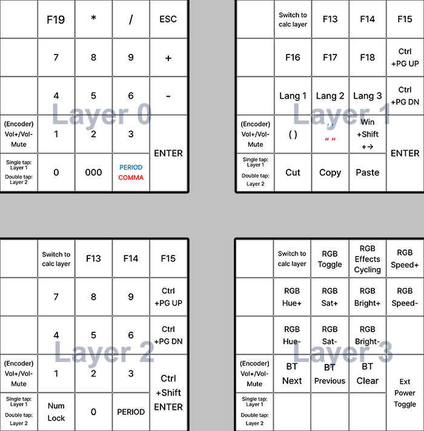

# zm-duc-k
Initial release: May 2022

A ZMK-based firmware for bluetooth wireless version of [Duckboard](https://doodboard.xyz/products/duckboard) macropad using the [nice!nano v2.0](https://nicekeyboards.com/nice-nano/) MCP. Derived from works by [jackh2000](https://github.com/jackh2000/zmk/tree/main/app/boards/shields/duckboard) and [nowyouare](https://github.com/nowyouare/zmk/releases/tag/v1.0), it updates the base ZMK package from 2.5.0 to the latest version to make use of macro and tap dance functions.

## Installation
1. [Download duckboard-nice_nano_v2-zmk.uf2]([url](https://github.com/butterdori/zmk-config/releases))
2. Connect using USB and put it into bootloader mode (short GND and RST pins twice quickly)
3. Nice Nano will appear as a storage on your computer.
4. Copy the UF2 file to Nice Nano and disconnect

## Layout
- The firmware consists of 4 layers: Layer 0 - Calc; Layer 1 - Apps and Func; Layer 2 - Game; Layer 3 - RGB and Bluetooth.
- Assigning F19 as a shortcut to calculator means double tapping the key switches the layer to the calculator layout and launches calculator. 
- F13~F18 can be assigned to other programs, or used as you see fit. 
- Ctrl+Pg Up/Dn can be used to move between tabs in the browser. 
- Lang 1/2/3 keys are actually Ctrl+Shift+1/2/3, which can be assigned to the different language keyboards you are using. Since Windows 7, there is an unfixed bug where the assigned key sequences for language keyboards are erased for random reasons (sleep, log out, shutdown etc.). There is a way to fix this [here]([url](https://superuser.com/questions/958901/set-shortcuts-to-change-keyboard-layout-in-windows-10)).
- Parentheses and quotations enter both endings and presses the left arrow key once, placing you in the middle. 
- Win+Shift+Right arrow key moves the selected window to your right monitor (if already in the right monitor, it goes to the left monitor). 
- Ext Power Toggle is used when the OLED is not functioning, which can happen due to current limitations in ZMK displays. 
- Number keys for layer 2 are keypad keys, and thus should be used in conjunction with Num Lock.

Red: Tap  
Blue: Hold

**Combo keys (usable in all layers; layer 0 assignments):**  
F19 + ESC: Boot to bootloader (install firmware)  
F19 + /: Reset  
F19 + 7: Next Bluetooth profile (max 3 devices; can be changed)  
F19 + 8: Previous Bluetooth profile  
F19 + 9: Clear Bluetooth profiles  
F19 + 1: Switch to calc layer (0)  
F19 + 2: Switch to apps layer (1)  
F19 + 3: Switch to game layer (2)  
F19 + 4: Switch to RGB & Bluetooth layer (3)  
F19 + 0: Toggle RGB  
